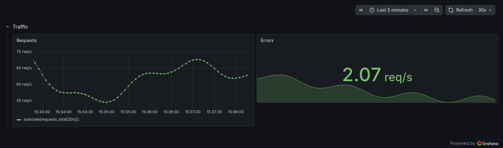
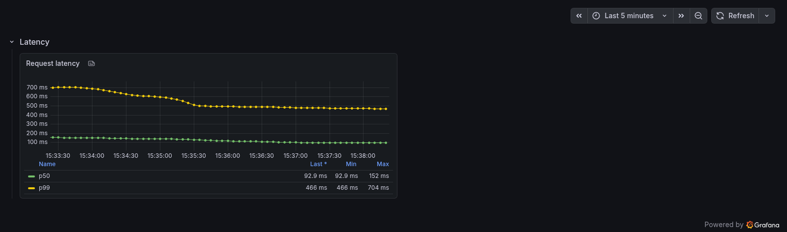
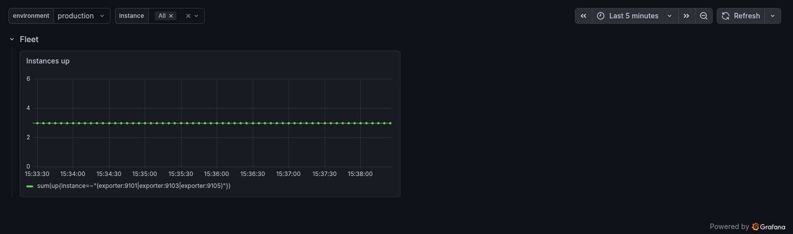
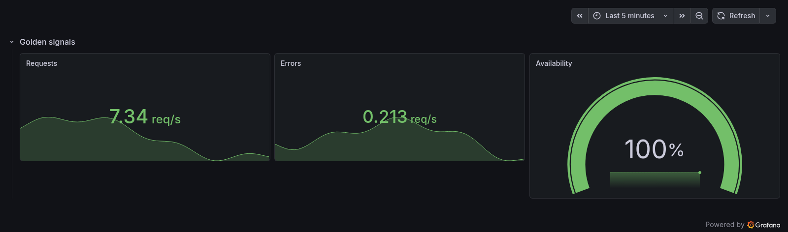
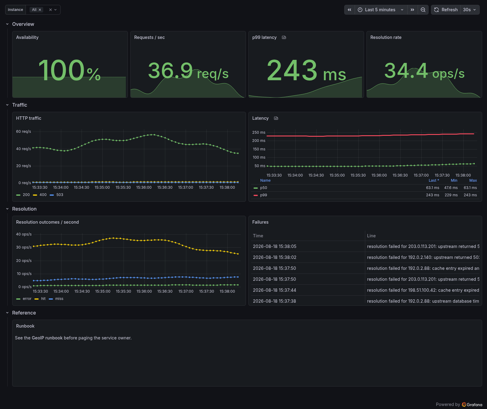
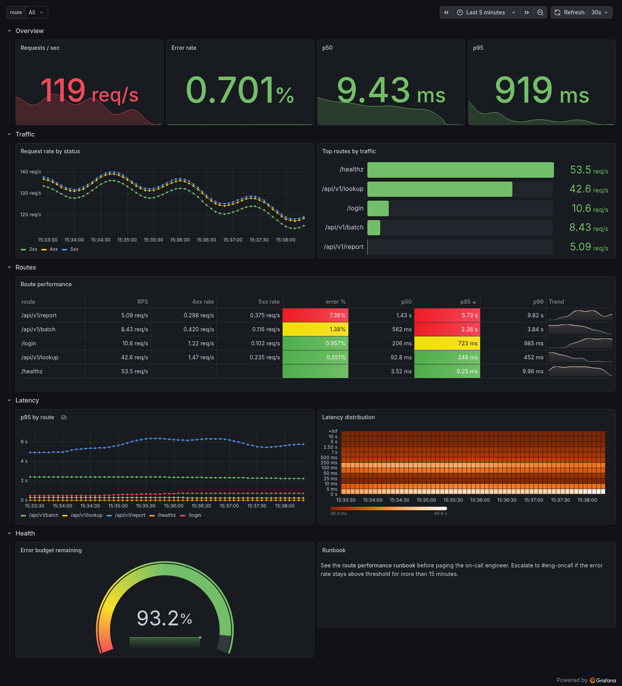

<!-- SPDX-License-Identifier: Apache-2.0 -->
# Example dashboards

Every screenshot below is a real Grafana 13 instance rendering the dashboard
that the example beside it prints. None of them is a mockup, and none was
edited by hand. `make render-examples` regenerates all six by running
`cargo run --example <name>`, provisioning the JSON that comes out, and
asking Grafana's image renderer for a PNG, so an image cannot quietly drift
away from the code it illustrates.

## Run them yourself

```bash
make demo
```

That boots Prometheus, Loki, and Grafana in Docker, generates all six
dashboards from the examples, and provisions them. Grafana comes up on
<http://localhost:3000> with anonymous admin access, so there is no login.
Click into any dashboard, edit a panel, and read the JSON Panelist produced.

```bash
make demo-down
```

Stops the stack and deletes its volumes.

The data is synthetic. A small exporter in [`demo/exporter.py`](demo/exporter.py)
serves exactly the metric names, labels, and jobs these examples query, and
[`demo/logs.py`](demo/logs.py) feeds the Loki stream behind the log panel.
The shapes are plausible rather than real, but the queries, transformations,
and panel options are the genuine article: every PromQL expression in the
screenshots really ran.

---

## `basic`

[Source](../crates/panelist/examples/basic.rs) ·
`cargo run -p panelist --example basic`

The smallest dashboard worth writing: one row, a time series, and a stat. It
sets no datasource, so both panels inherit Grafana's default.



---

## `prometheus`

[Source](../crates/panelist/examples/prometheus.rs) ·
`cargo run -p panelist --example prometheus`

The same job done with the builder API instead of the macro DSL. Two
`histogram_quantile` targets share a panel, each with its own legend format,
under green/yellow/red thresholds and a table legend showing last, min, and
max per series.



---

## `variables`

[Source](../crates/panelist/examples/variables.rs) ·
`cargo run -p panelist --example variables`

Two kinds of template variable. `environment` is a custom list with a
default; `instance` is a query variable resolved by `label_values`, set to
multi-select with an "All" option. The panel query filters on `$instance`.



---

## `layout`

[Source](../crates/panelist/examples/layout.rs) ·
`cargo run -p panelist --example layout`

Panels built by an ordinary Rust function and handed to a row as a `Vec`.
Nothing in the example names a coordinate: three eight-wide panels are placed
side by side because automatic layout packs them into the 24-column grid.



---

## `full_dashboard`

[Source](../crates/panelist/examples/full_dashboard.rs) ·
`cargo run -p panelist --example full_dashboard`

A service dashboard of the shape most teams actually run: availability,
throughput, and latency stats across the top, traffic and latency time series
with a per-series override on p99, resolution outcomes broken out by label, a
Loki-backed table of failures, and a markdown runbook pointer. Two
datasources on one dashboard, with Prometheus inherited from the dashboard
and Loki set on the one panel that needs it.



---

## `route_performance`

[Source](../crates/panelist/examples/route_performance.rs) ·
`cargo run -p panelist --example route_performance`

The dashboard that gates Panelist's typed-transformation work, and the
densest of the six. It chains three transformations on a single table panel
(`timeSeriesTable` into `joinByField` into `organize`), renders cells with
typed colored-background and sparkline renderers, sorts by a named column,
uses all three Prometheus result formats across its queries, and draws a
latency heatmap. It reaches for no raw Grafana JSON anywhere, which a test
enforces.


